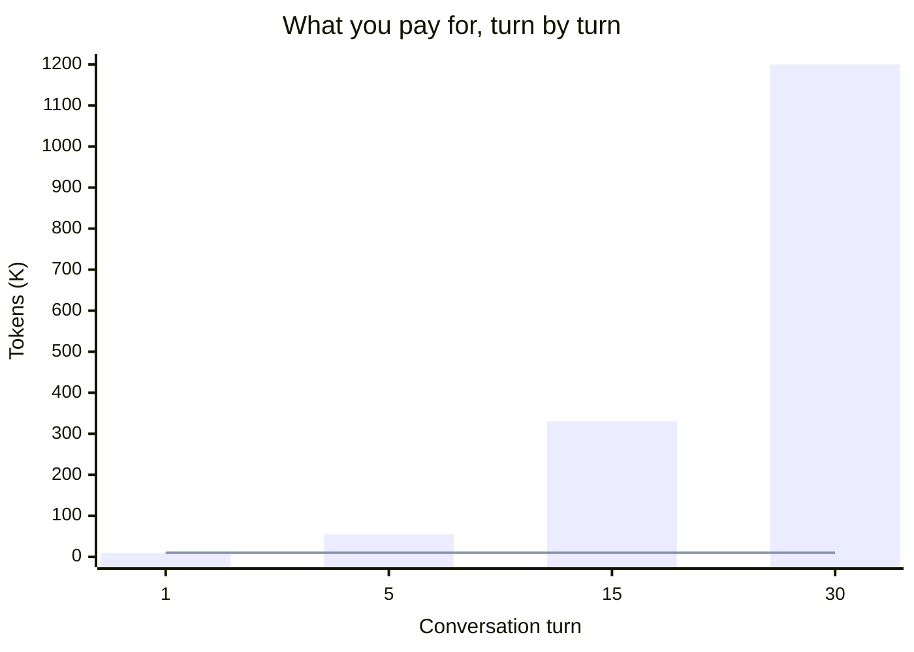

# copytab

One-shot your LLM with only the content that matters.

CLI tool that copies all open IDE tabs to your clipboard on macOS.

## Why

I was building this very tool using Claude Code (vanilla setup, no custom hooks or MCP servers). After a session, the API dashboard showed I had burned through **3.8M+ tokens** in a single sitting. That felt wrong.

So I exported the conversation and ran it through a tokenizer — the actual content was only **~33K tokens**. That's a 100x discrepancy.

### What's happening

This isn't a bug. LLM APIs charge per **API call**, not per unique conversation content. Every time you send a message in Claude Code (or any coding agent), the **entire conversation history** is re-sent to the model — your code, tool results, system prompts, everything.



Each turn re-sends everything that came before it. By turn 30, you've paid for the same tokens over and over — the cost compounds quadratically while your actual unique content stays flat.

This is by design — it's how stateless APIs work. The longer the conversation, the worse the compounding.

### The idea

Instead of letting an agent wander through your codebase across dozens of turns, grab the files you care about and give the model exactly what it needs in **one shot**. Fewer turns, less token waste, more control over what you're paying for.

```bash
copytab --content    # Grab file contents from your open tabs
# Paste into your LLM. One message. Done.
```

The irony of burning millions of tokens to build a tool that helps you stop burning tokens is not lost on me.

## Supported IDEs

- VS Code / Cursor
- GoLand / IntelliJ IDEA / PyCharm / WebStorm / DataGrip

## Install

```bash
go install github.com/NaheedRayan/copytab@latest
```

Make sure `~/go/bin` is in your `PATH`:

```bash
export PATH="$HOME/go/bin:$PATH"
```

Then run:

```bash
copytab
```

## Quick Start

```bash
copytab                         # Auto-detect frontmost IDE, copy tab paths to clipboard
copytab --ide=vscode            # Copy VS Code tab paths
copytab --ide=goland            # Copy GoLand tab paths
copytab --ide=all               # Collect from all IDEs, deduplicate, copy to clipboard
copytab --content               # Copy file contents instead of file paths
copytab --print                 # Print to stdout instead of clipboard
```

## Flags

| Flag | Default | Description |
|------|---------|-------------|
| `--ide` | `detect` | IDE to extract tabs from: `detect`, `all`, or a specific IDE name |
| `--content` | `false` | Copy file contents instead of file paths |
| `--print` | `false` | Print to stdout instead of copying to clipboard |

### IDE names

`vscode` · `cursor` · `goland` · `intellij` · `pycharm` · `webstorm` · `datagrip`

## Setup

### Accessibility permission (required for JetBrains IDEs)

JetBrains IDEs cache workspace state to disk and don't flush it on every tab change. To get **live** tab data, `copytab` triggers a "Save All" via AppleScript before reading the workspace file.

This requires granting **Accessibility** permission to your terminal app:

1. Open **System Settings > Privacy & Security > Accessibility**
2. Click the **+** button
3. Add your terminal app (e.g. **Terminal**, **iTerm2**, **Warp**, **VS Code**)

Without this permission, JetBrains tabs will still work but may reflect a slightly stale state.

## Development

Run directly from the repo without installing:

```bash
go run . --print
go run . --ide=goland --print
go run . --ide=goland --content --print
```

Build a binary:

```bash
go build -o copytab .
```

## How It Works

**VS Code / Cursor** — Reads the SQLite database (`state.vscdb`) from the most recently used workspace under `~/Library/Application Support/{Code,Cursor}/User/workspaceStorage/<hash>/`. Tab data is stored in a `memento/workbench.parts.editor` key as JSON and is always up to date.

**JetBrains IDEs** — Triggers a "Save All" via AppleScript to flush workspace state to disk (requires Accessibility permission). Then parses `recentProjects.xml` to find the currently open project (`opened="true"`), and reads its workspace XML file to extract open file entries from the `FileEditorManager` component.

**Clipboard** — Uses macOS `pbcopy`.
